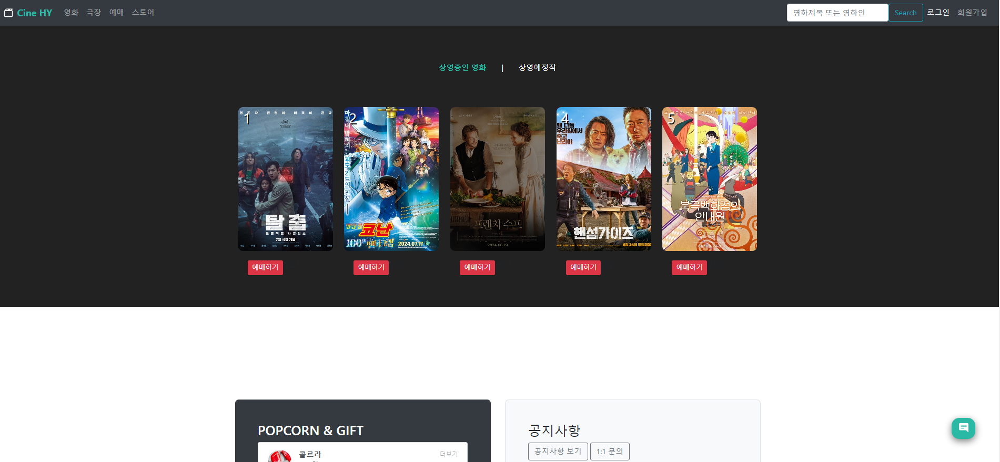
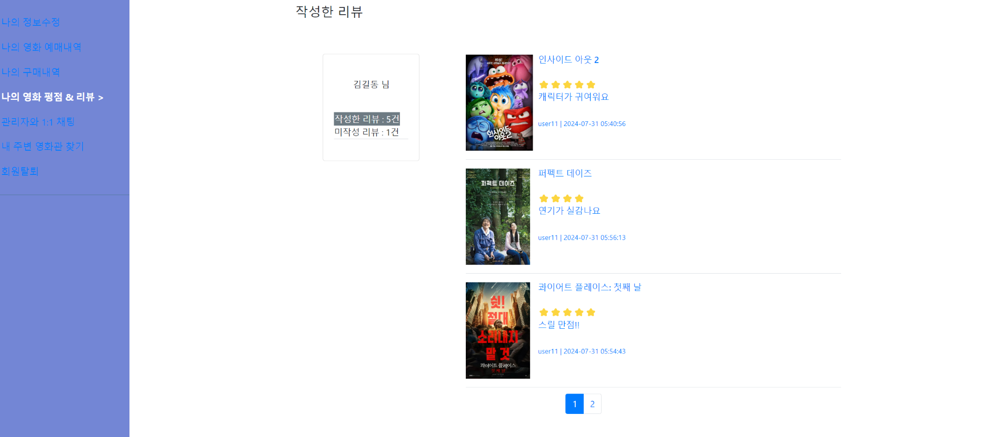
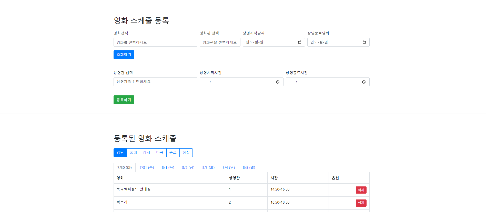
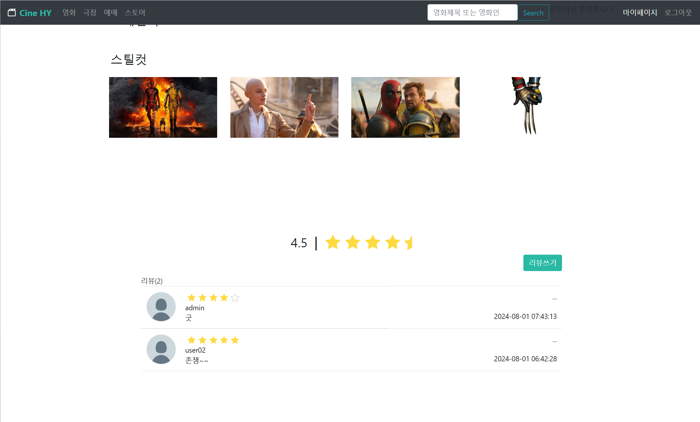

## 📃목차 

- [📃목차](#목차)
- [팀원](#팀원)
- [cineHY](#cinehy)
- [프로젝트 개요](#프로젝트-개요)
- [개발 환경](#개발-환경)
- [테이블 설계](#테이블-설계)
    - [테이블 설계시 중점사안](#테이블-설계시-중점사안)
  - [주요 테이블 설명](#주요-테이블-설명)
  - [테이블 설계 시 느꼈던 점](#테이블-설계-시-느꼈던-점)
- [구현 기능](#구현-기능)
  - [사용자 기능](#사용자-기능)
  - [관리자 기능](#관리자-기능)
- [기여도](#기여도)
- [화면 구성](#화면-구성)
- [주요기능](#주요기능)
  - [로그인/회원가입](#로그인회원가입)
  - [아이디 찾기](#아이디-찾기)
  - [비밀번호 찾기](#비밀번호-찾기)
  - [정보수정/회원탈퇴](#정보수정회원탈퇴)
  - [영화 API](#영화-api)
  - [영화 스케줄 관리](#영화-스케줄-관리)
  - [멀티검색](#멀티검색)
  - [예매](#예매)
  - [결제](#결제)
  - [리뷰](#리뷰)
  - [오픈톡](#오픈톡)
  - [공지](#공지)
- [Trouble Shooting](#trouble-shooting)
- [](#)

## 팀원

<table>
   <tr>
    <td align="center"><b><a href="https://github.com/jwj4546">조우진</a></b></td>
    <td align="center"><b><a href="https://github.com/Kimmingle">김민아</a></b></td>
    <td align="center"><b><a href="https://github.com/kimpilgyu0214">김필규</a></b></td>
    <td align="center"><b><a href="https://github.com/leeyangie">이연정</a></b></td>
  <tr>
     <td align="center"><a href="https://github.com/jwj4546"></a></td>
    <td align="center"><a href="https://github.com/Kimmingle"></a></td>
     <td align="center"><a href="https://github.com/kimpilgyu0214"></a></td>
      <td align="center"><a href="https://github.com/leeyangie"></a></td>
  </tr>
  <tr>
    <td align="center"><b>Web Developer</b></td>
    <td align="center"><b>Web Developer</b></td>
    <td align="center"><b>Web Developer</b></td>
    <td align="center"><b>Web Developer</b></td>
</table>

## cineHY

**프로젝트 기간**: 2024-06-11 ~ 2024-08-02  
**팀 명**: 화양영화  
**한 줄 소개**: The prime of one's life  
**GitHub**: [cineHY GitHub Repository](https://github.com/jwj4546/cineHY)

## 프로젝트 개요

cineHY는 다양한 영화 목록을 외부 API를 통해 JSON 형식으로 데이터를 전달 받아 사용자가 개인 맞춤형 영화 예매를 할 수 있는 웹 사이트를 제공합니다. 영화 선호도에 따라 추천과 예매 시스템을 구현하여 사용자에게 최적의 영화 경험을 제공합니다.

## 개발 환경

- **운영체제**: Windows 10 (개발환경) / AWS EC2_Windows (운영환경)
- **IDE**: STS3 (Spring Tool Suite) 3.9.8 RELEASE, Visual Studio Code 1.91
- **DBMS**: Oracle Release 21.0.0.0.0
- **WAS**: Apache Tomcat 10
- **Language**: Java (Amazon Corretto JDK 17), JavaScript
- **Front-end**: HTML5, CSS3
- **Library**: JSTL, jQuery 3.7.1
- **Collaboration Tools**: Notion, Slack, GitHub, Google Spreadsheet

## 테이블 설계


#### 테이블 설계시 중점사안

- **유지보수의 용이함**: 정규화와 성능 최적화 사이의 균형을 적절하게 유지하며 데이터의 유지보수가 용이하도록 설계
- **데이터 무결성과 일관성 보장**: 외래키와 고유 키를 설정하여 각 테이블 간의 관계를 명확히 하고 데이터의 무결성을 보장합니다.
- **Open API 활용**: 데이터 저장 및 조회 기능을 표준화 된 Open API를 통해 구현하고 필요한 DB만 저장하여 활용
- 관리자 관점에서의 CRUD 기능 구현

### 주요 테이블 설명

- **TB_MOVIE_SCHEDULE Entity**
  - 영화 상영 스케줄 정보를 저장하기 위한 테이블입니다.
  - 스케줄 등록 시 일정 기간 동안 같은 상영시간을 반복 등록할 수 있도록 `STARTDATE`와 `ENDDATE` 컬럼을 구성했습니다.
  - `SCREENING_ID` 컬럼을 PK로 구성하고 SEQUENCE를 통해 값을 INSERT합니다.
  - 1개의 영화, 극장, 상영관이 여러 스케줄을 가질 수 있으며, 이 관계를 외래키로 설정하고 CASCADE 삭제를 적용하고 부모테이블의 조건에 따라 행이 삭제될 수 있도록 트리거 설정이 되어있습니다.

- **TB_MOVIE Entity**
  - 상영하는 영화의 정보를 저장하기 위한 테이블입니다.
  - 영화 Open API 데이터를 조회하여 선택된 영화의 데이터를 INSERT합니다.
  - 영화 Open API의 고유값인 영화 코드를 PK로 구성했습니다.

- **TB_THEATER Entity**
  - 극장 정보를 저장하기 위한 테이블입니다.
  - 중복되지 않는 PK로 `THEATER_CODE`를 구성했습니다.

- **TB_SCREEN Entity**
  - 상영관 정보를 저장하기 위한 테이블입니다.
  - 중복되지 않는 PK로 `SCREEN_CODE`를 구성했습니다.

- **TB_MEMBER**
  - 회원관련 정보를 저장하는 테이블입니다.
  - USER_ID를 PK로 설정했습니다.
  - 회원탈퇴, 관리자의 의한 강제탈퇴가 아니라면 STATUS는 'Y'를 기본값으로 가집니다.
  - USER_ID, USER_PWD, USER_NAME, PHONE_NO는 NULL을 허용하지 않습니다. 

- **TB_REVIEW**
    
  - 영화의 리뷰를 저장하기 위한 테이블입니다. 
    
  - 회원 테이블의 userId와 영화 테이블의 movieCode, 예매 내역 테이블의 TicketNo를 외래키로 가지며 한 명의 사용자는 영화 하나 당 하나의 리뷰만 작성할 수 있습니다.

- **TB_OPEN_TALK**
    
  - 여러 명의 사용자들이 대화를 할 수 있는 오픈톡 테이블입니다. 
  - userId를 외래키로 가지며 하나의 채팅방에서만 대화가 이루어지기 때문에 채팅방 컬럼은 존재하지 않습니다.

- **TB_NOTICE Table**
    관리자가 공지사항을 등록할 수 있는 공지사항 게시판이다. 
    관리자가 작성 할 것이기 때문에 userId를 외래키로 설정하였다.

### 테이블 설계 시 느꼈던 점

- **데이터 모델링의 복잡성**: 이론적으로 배운 내용을 실제로 구현할 때 예상치 못한 복잡한 상황들이 발생했습니다. 조인 테이블의 설계와 데이터 타입 선택 등에서 많은 경험이 필요하다는 것을 느꼈습니다.
- **팀 협업의 중요성**: 테이블 설계는 혼자서 하는 작업이 아니라 팀원들과의 협업이 필수적입니다. 데이터베이스 구조에 대한 공통된 이해를 공유하는 것이 중요합니다.
- **정규화**: 데이터 중복을 최소화하고 무결성을 유지하기 위한 정규화의 중요성을 배웠습니다. 그러나 지나친 정규화는 성능 저하와 데이터 관리의 어려움을 초래할 수 있습니다.
- **테이블 칼럼 설계**: 프로젝트를 진행하다보니 최초 설계한 칼럼에서 추가해야 하는 칼럼, 실제로 기능구현 할 때 사용하지 않아 쓸모가 없는 칼럼등이 생겼습니다. 팀원간의 긴밀한 소통과 본인이 설계하는 기능을 보다 구체적이고 섬세하게 계획하면 불필요하게 쓰일 시간과 자원을 아낄 수 있습니다. 

## 구현 기능

### 사용자 기능

- **회원 서비스**: 로그인, 아이디 찾기, 비밀번호 찾기, 로그아웃, 회원가입, 회원탈퇴, 마이페이지 (내 정보 수정, 내 주변 영화관 찾기, 내가 작성한 리뷰 조회, 미작성 리뷰 조회), WebSocket을 통한 실시간 메시지 수신/송신, 공지사항 목록 조회 및 글 상세 보기
- **메인 페이지**: TOP5 영화, 상영예정작 게시, 스토어 목록 게시, 영화 및 영화인 통합 검색 기능
- **영화**: 상영중인 영화 조회, 상영 예정 영화 조회, 선호도별 추천 영화 조회, 영화 상세정보 보기
- **극장**: 극장별 및 날짜별 영화 스케줄 조회
- **예매**: 예매 정보 선택, 좌석 선택, 예매 결제, 예매 정보 출력 및 조회
- **스토어**: 상품 리스트 조회, 상품 상세 보기, 장바구니 추가, 수량 조절, 삭제, 결제 금액 검증, 결제 기능, 결제 정보 확인


### 관리자 기능

- **회원 관리**: 회원 목록 조회, 선택 회원 정보 상세조회, 회원 강제 탈퇴
- **영화 관리**: 영화 등록 (Open API 조회), 영화 상세정보 보기, 영화 등록, 삭제, 등록 리스트 조회, 영화 스케줄 (등록된 스케줄 조회, 영화 및 날짜별 스케줄 조회, 스케줄 등록, 삭제)
- **공지 관리**: 공지 글 등록, 삭제, 수정 (관리자만)
- **스토어 관리**: 스토어 상품 등록, 수정, 삭제

## 기여도

- **담당 기능**: 데이터베이스 설계 및 테이블 관리, 일부 기능 구현 및 테스트

## 화면 구성
|  |  |  |  |
| :----------------------------------------------------------: | :----------------------------------------------------------: | :----------------------------------------------------------: | :----------------------------------------------------------: |
|                        메인페이지                         |                       로그인                       |                       회원가입 페이지                       |                 비밀번호 찾기                  |


|  |  |  |  |
| :----------------------------------------------------------: | :----------------------------------------------------------: | :----------------------------------------------------------: | :----------------------------------------------------------: |
|                        영화리스트                         |                       극장별 영화스케줄                       |                       예매페이지 페이지                       |                 영화 상세페이지                  |

|  |  |  |  |
| :----------------------------------------------------------: | :----------------------------------------------------------: | :----------------------------------------------------------: | :----------------------------------------------------------: |
|                        영화리스트                         |                       영화리뷰                      |                       스토어                       |                 좌석 선택                  |

|  |  |  |  | 
| :----------------------------------------------------------: | :----------------------------------------------------------: | :----------------------------------------------------------: | :----------------------------------------------------------: |
|                        1:1채팅문의                         |                       오픈톡                      |                       영화검색                       |                 영화 스케줄 등록                  |

|  |  |  |  |
| :----------------------------------------------------------: | :----------------------------------------------------------: | :----------------------------------------------------------: | :----------------------------------------------------------: |
|                        회원정보 수정                         |                       회원관리                      |                       장바구니                       |                 영화관 찾기                  |


## 주요기능

### 로그인/회원가입


### 아이디 찾기


### 비밀번호 찾기


### 정보수정/회원탈퇴


### 관리자 멤버조회


### 영화 API

사용한 영화 OPEN API : TMDB OPEN API
- **TMDB** : 영화, TV 프로그램을 수집하여 데이터베이스로 만드는 회사
오픈소스를 지향한다는 것이 특징
국내의 영화 관련 OPEN API(대표적으로 영화진흥위원회 OPEN API)보다 좋은 점은 영화 포스터, 다양한 스틸컷 이미지도 제공하기 때문에 해당 API를 선택하게 되었습니다.

사용자 페이지


front: OPEN API 영화 데이터 중 관리자가 등록한 영화를 박스오피스 순 / 선호도별 추천영화 / 상영 예정 영화가출력이 되도록 AJAX로 응답을 받아 출력하는 코드입니다.

박스오피스와 상영예정작에 대한 실시간 순위정보를 받기위해 등록한 영화를 출력할때마다 API가 호출됩니다. 이때 관리자가 등록한 영화만 출력되도록 하는 것이 기능 구현의 목표였습니다.

먼저 TB_MOVIE 에서 등록한 영화 정보를 가져와 movieIdList로 담아줍니다.
상영등급은 추후에 문제점에서도 나오지만 API에서 호출해오는 과정을 최소화 하기위해 INSERT 시에 함께 담아두었습니다. 해당 정보도 출력하기 위해 movieRatings에 담았습니다.
```javascript
const movieIdList = [];
const movieRatings = {};

const getMovieList = () => {
    return $.ajax({
        url: 'movieList/movieEnrollList',
        method: 'GET',
        dataType: 'json',
        success: response => {
            const data = response.data;
            for (const movieDB of data)
            movieIdList.push(movieDB.movieCode);
            
            if (!Array.isArray(data)) {
                data = [data];
            }
            data.forEach(movie => {
                movieRatings[movie.movieCode] = movie.rating;
            });
        },
        error: function() {
            console.log('데이터를 불러올 수 없습니다.');
        }
    });
}

```
그리고 실시간으로 순위에 대한 정보를 받기위해 OPEN API 정보를 AJAX로 요청하고
받아온 데이터를 출력 시에 위에서 저장해둔 movieIdList의 id가 일치하는 영화만 출력하도록 조건문을 추가했습니다.


```javascript

const fetchMovies = () => {
    $.ajax({
        url: 'movieList/nowPlaying',
        method: 'GET',
        dataType: 'json',
        success: data => {
            displayMovies(data);
            displayLikeMovies(data);
        },
        error: function(jqXHR, textStatus, errorThrown) {
            console.error('영화 데이터를 불러오는 중 오류 발생:', textStatus, errorThrown);
        }
    });
}

const displayMovies = (data) => {
    const movieList = $('#movieList');
    movieList.empty();
    let rank = 1;

    const $fragment = $(document.createDocumentFragment());

    data.forEach((entry) => {
        if (entry.results && entry.results.length > 0) {
            entry.results.forEach((movie) => {
                if (movieIdList.includes(movie.id)) {  // 조건문 추가
                    const rating = movieRatings[movie.id] || 'N/A';
                    const movieCardHtml =; 
                    
                    ...생략
                }
          });      
     });
}
                
```

back: 하나의 페이지 번호를 파라미터로 받는 OPEN API 영화 리스트를 요청할 경우, 특정 페이지에 조건에 일치하는 영화만 나오는 문제를 해결하기 위해 컨트롤러에서 10페이지까지의 데이터를 한 번에 받아와서 요청한 페이지에 맞는 영화 리스트를 제공하도록 반복문을 활용했습니다.

```javascript
private static final String API_URL = "https://api.themoviedb.org/3/movie/";
private static final String BEARER_TOKEN = "Bearer MY TOKEN ><"; // 여기에 실제 Bearer Token을 입력
private static final int TOTAL_PAGES = 10; //반복횟수

@GetMapping("nowPlaying") // 상영중인 영화 맵핑값
public String getNowPlayingMovie() throws IOException {

    OkHttpClient client = new OkHttpClient();
    List<String> allMoviesResponses = new ArrayList<>();

    for (int pageNumber = 1; pageNumber <= TOTAL_PAGES; pageNumber++) {
        Request request = new Request.Builder()
                .url(API_URL + "now_playing?language=ko-KR&region=KR&page=" + pageNumber + "&include_image_language=en,null&sort_by=popularity.desc")
                .get()
                .addHeader("accept", "application/json")
                .addHeader("Authorization", BEARER_TOKEN)
                .build();

        try (Response response = client.newCall(request).execute()) {
            okhttp3.ResponseBody responseBody = response.body();
            if (responseBody != null) {
                allMoviesResponses.add(responseBody.string());
            }
        }
    }
    String combinedResponse = "[" + String.join(",", allMoviesResponses) + "]";
    return combinedResponse;
}

```

**`선호도별 영화`**

TB_MEMBER의 GENRE 데이터와 비교하여 포함하는 영화 조회

**`상영 예정 영화`** 

날짜별로 조회

---

관리자 페이지


상영중인 영화 정보를 관리자가 조회할 수 있도록 영화 OPEN API (TMDB)를 활용하여 pageNo를 파라미터로 AJAX 를 통해 영화정보 데이터를 조회하는 기능을 구현했습니다. 

`pageNo`는 하단 페이지 버튼에 1씩 증감하는 함수를 구현해 파라미터를 전달하고 새로운 데이터를 요청합니다. 

상단 영화리스트의 view 버튼 클릭 시 해당 `movieId`를 파라미터를 포함하는 url로 요청하여 상세정보가 AJAX를 통해 받아온 데이터가 출력됩니다. 

관리자가 선택한 영화의 정보를 즉시 확인 할 수 있도록 하단으로 자동 스크롤 되도록  scrollDownView() 함수가 실행되도록 코드를 추가했습니다.


### 영화 스케줄 관리

기획 단계에서 관리자가 스케줄을 등록할 때 필요한 정보가 어떤 것들이 있을지 고민했습니다.

등록 전 기존 상영 스케줄을 확인할 수 있도록 `movieCode`, `theaterCode`, `startdate`, `enddate` 값을 입력 받아 AJAX를 통해 조회하는 기능을 구현 했습니다.
우선 옵션에 등록된 TB_MOVIE, TB_THEATER의 정보를 출력하여 변동되는 데이터에 따라 동적으로 옵션 값이 변하도록 출력했습니다.

**영화, 영화관, 상영날짜와 중복되는 스케줄 조회** : 
`movieSelect`, `theaterSelect`, `startdateSelect`, `enddateSelect` 옵션을 모두 선택하고 조회 버튼 클릭 시 해당 옵션의 스케줄을 가져오는 AJAX 요청을 보냅니다.
이때 옵션을 모두 선택하지 않으면 조회를 할 수 없도록 조건문을 추가하고 영화 개봉일이 상영 시작일로 자동 선택되도록 자바스크립트를 이용해 설정했습니다. 

조회하는 날짜와 등록된 스케줄의 날짜가 교차되는 범위를 모두 조회하기 위한 SQL 구문을 작성했습니다.
TB_MOVIE_SCEDULE 에서 
선택한 `movieCode`와 `thaterCode`가 일치하고
선택한 `startDate`와 `endDate`를 DB의 STARTDATE, ENDDATE 데이터와 BTWEEN ~ AND 구문으로 날짜 범위가 교차되는 조건을 만족하는 모든 컬럼을 SELECT 합니다.

상영 스케줄은 날짜범위를 지정할 수 있기 때문에 등록기능 구현시 스케줄 중복검사가 필수라고 생각했습니다.INSERT 실행 시, 스케줄이 중복되지 않도록 선택한 값을 파라미터로 받아 중복 스케줄이 있는지 비동기 방식으로 요청하는 checkSchedule ( ) 함수를 만들었습니다.

상영시작시간과 종료시간 선택 시 서로 값을 비교하여 시작시간이 종료시간을 넘을 수 없도록 처리했습니다. 

### 멀티검색


`keyword`를 전역변수로 선언 후 등록된 영화 리스트(movieIdList) AJAX 요청과 키워드를 파라미터로 받아 OPEN API에서 검색결과(searchMovie( ))를 받아오는 AJAX 요청을 보냅니다. `search` 함수는 `getMovieRatings`와 `searchMovies` 함수가 모두 완료될 때까지 기다립니다. `Promise.all`을 사용하여 두 비동기 작업을 병렬로 실행합니다.

받아온 검색결과 데이터 중 ‘영화인’은 media_type이 `people` 인 조건으로 filter함수를 사용해 필터링하여 map과 join을 사용해 반복출력합니다.

같은 구조로 결과값의 known_for(대표작품) 3개를 함께 출력합니다.

‘상영중인 영화’는 media_type이 movie 인 데이터 중 TB_MOVIE 에서 가져온movie_code와 일치하는 조건문으로 반복 출력합니다.

### 예매

seat.jsp(ajax)


### 결제

postPrepare()


validatePayment()


### 리뷰

영화 상세보기 페이지인 movieDetail.jsp에서 review.jsp 페이지를 인클루드 하여 리뷰페이지를 구성하였고 인클루드 할 때 영화 아이디를 파라미터로 받아 해당 영화에 대한 정보를 얻어왔습니다. ajax를 이용해 비동기식으로 처리하였고 영화 아이디로 특정 영화의 리뷰를 출력하기 위해  movieId를 파라미터로 넘겼고 페이징처리도 비동기식으로 처리하기 위해 page값도 함께 파라미터로 보냅니다. 


ajax요청은 컨트롤러의 selectReview로 매핑되어 영화 아이디로 리뷰 조회를 한 후 조회된 리뷰를 10개씩페이징 설정을하여 요청했던 화면으로 반환힙니다. 
ajax에서 성공적으로 값을 받으면 리뷰와 페이징 정보를 for문으로 html형식을 만들어 출력하였으며 반환받은 페이징 정보대로 10개씩 화면에 출력되게 하였습니다. 


리뷰 쓰기를 누르면 insert를 하기위한 모달창이 뜹니다. 
리뷰는 해당 영화를 예매한 사람만 쓸 수 있도록 하였으므로 
예매 내역이 있는 사용자라면 비동기식으로 리뷰 추가가 이루어지지만 예매 내역이 없는 사용자라면 리뷰가 insert되지 않고 예매 내역 확인해달라는 창이 뜹니다.  


마이페이지에서 사용자가 작성한 리뷰를 볼 수 있으며 영화를 관람하였지만 아직 리뷰를 작성하지 않은 항목은 미작성 리뷰에서 조회할 수 있습니다.
작성한 리뷰와 미작성 리뷰에 클릭 이벤트를 주어 각각 내가 쓴 리뷰를 조회하는 ajax와 리뷰를 아직 작성하지 않은 내역을 조회하는 ajax가 실행되어 화면에 출력 됩니다.

이때도 아까와 같이 요청 ajax에 페이지를 파라미터로 보내서 비동기식으로 페이징을 처리하였습니다.

미작성 리뷰를 조회하기위해 


아직 리뷰를 작성하지 않은 내역은 예매내역 테이블, 영화 스케줄 테이블, 영화 테이블을 조인하여 영화 코드, 제목, 결제 시간 정보를 얻어서 결제한 시간순으로 출력을 하였으며 작성한 리뷰는 제외하기 위해 사용자가 작성한 리뷰를 서브쿼리로 조회한 후 NOT IN처리를 해주었습니다. 

요청 화면에서 리뷰를 작성하지않은 관람내역을 확인할 수 있습니다. 


### 오픈톡


### 공지

## Trouble Shooting
- **영화 데이터 삭제 시 회원의 예매 내역과 리뷰 내역이 보이지 않는 문제**
  
  등록한 영화 데이터 삭제시 DELETE하여 아예 테이블에서 삭제해버리면 예매내역과 리뷰내역이 조회될 수 없게 되어버려 기능이 구현 된 후에 테이블을 수정해야하는 문제가 발생했습니다.

  TB_MOVIE 테이블에 STATUS 컬럼을 추가하고 DELETE를 해야할 경우에 STATUS='N'으로 UPDATE하도록 수정했는데, 삭제 시 재등록하는 경우 PK가 중복되는 문제가 다시 생겼습니다. 또 연관 데이터인 영화 스케줄이 CASCADE제약 조건을 걸어두어도 부모 테이블의 데이터가 UPDATE 되는 것이라서 함께 삭제되지 않는다는 문제도 생겼습니다. 비슷한 문제들을 서칭해본 후 MERGE와 트리거를 이용해 해결할 수 있었습니다.
  
  ##

- **상영등급 데이터 정보 추출**
  
  TMDB 데이터 중에 Release Dates 라는 movie_id를 파라미터로 받고 release_dates가 endpoint인 데이터가 있습니다. 왜인지는 알 수 없지만 여기에 상영등급에 대한 정보가 별도로 담겨있고 이 정보들은 iso_3166_1 키값을 가집니다. 처음에는 이 정보를 몰라서 서칭하다보니 API관련 오픈 게시판에서 찾을 수 있었습니다. 
  
  해당 url 정보로 AJAX요청을 하고 콜백함수로 받아온 값의 길이만큼 순회하여 우선 iso_3166_1 값이 KR(한국)을 갖는 정보를 releases변수에 담아줍니다. 이 배열은 해당 국가에서의 다양한 릴리즈 날짜와 등급 정보를 포함합니다. 이 배열을 다시 한번 for문으로 순회하여 상영등급 정보를 찾고 break문으로 빠져나와 값을 추출할 수 있었습니다.
  
  ```javascript
  $.ajax({
      url: 'movieList/rating',
      method: 'get',
      dataType: 'json',
      data: { movie_id: movieId },
      success: releaseData => {
          let rating = 'N/A';
          let countries = releaseData.results;
          for (let i = 0; i < countries.length; i++) {
              if (countries[i].iso_3166_1 === 'KR') {
                  let releases = countries[i].release_dates;
                  for (let j = 0; j < releases.length; j++) {
                      if (releases[j].certification) {
                          rating = releases[j].certification;
                          break;
                      }
                  }
                  break;
              }
          }
      }
  });
  
